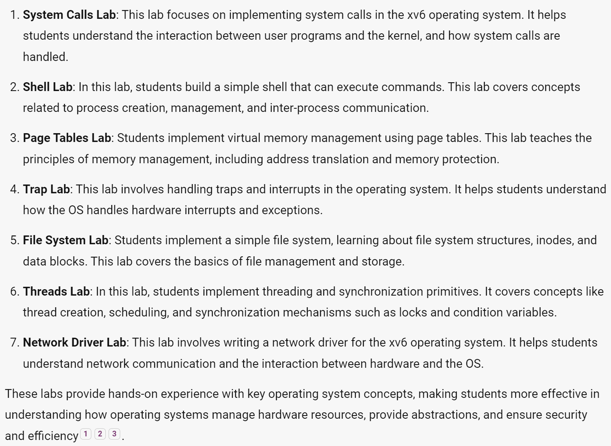

0x7fffffffdcc4
cast pointer to char ,  +1 , cast to int pointer.
0x7fffffffdcc5

a[1] 400:
end                                   begin
(0000 0000) 0000 0000 0000 0001 (1001 0000) 
1. drop first 8 bit and never use,no one use that.
2. fill last 8 bit into next araray cell.with 0000 0000
RULES to use little-endian with 
from right , least significant byte (LSB) to left , most significant byte (MSB) ,
least : 最小位, most :最大位
decimal: 123 1是MSB  binary: 0001 1 是LSB

after: shift 8 bit 

754974721:
0010 1101 0000 0000 0000 0000 0000 0001

a[2]: 301:
0000 0000 0000 0000 0000 0001 (0010 1101) :illegal use first 8bit of other cell from int[3] size array
